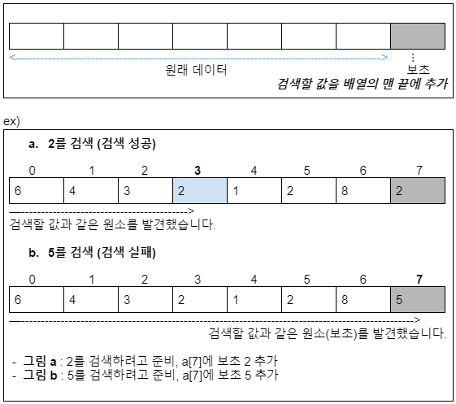
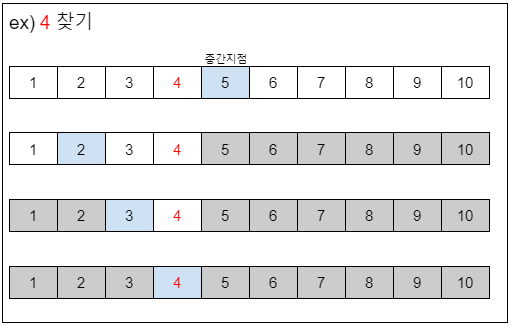

# 03 검색 알고리즘(배열검색)
검색의 종류 : 배열 검색, 연결 리스트 검색, 이진 검색 트리 검색

## 배열 검색
- 선형 검색 : 무작위로 늘어놓은 데이터 집합에서 검색 수행
- 이진 검색 : 일정한 규칙으로 늘어놓은 데이터 집합에서 아주 빠른 검색 수행
- 해시법 : 추가⋅삭제가 자주 일어나는 데이터 집합에서 아주 빠른 검색 수행
    - 체인법: 같은 해시값 데이터를 연결 리스트로 연결하는 방법
    - 오픈 주소법: 데이터를 위한 해시값이 충돌할 때 재해시하는 방법

## 선형 검색 linear search (순차 검색 sequential search)
- 직선 모양(선형)으로 늘어선 배열에서 검색하는 경우에 원하는 키 값을 가진 원소를 찾을 때까지 맨 앞부터 스캔하여 순서대로 검색하는 알고리즘

- 원소의 값이 정렬되지 않은 배열에서 검색할 때 사용하는 유일한 방법

### 선형 검색의 종료 조건
1. 검색할 값을 찾지 못하고 배열의 맨 끝을 지나간 경우	        … 검색 실패
2. 검색할 값과 같은 원소를 찾는 경우				           … 검색 성공

#### 보초법 sentinel method
- 반복의 종료를 알리는 특정한 값인 보초(sentinel) 값을 사용하여 종료 조건 중 검색 실패 조건을 제거하여 판단 횟수를 줄이는 방법
    -   ∴ 반복 종료 조건 검사 비용(cost)을 반으로 줄이는 방법

- 보초 sentinel:검색하고자 하는 키 값을 배열의 맨 끝에 저장하는데, 이때 저장하는 값

## 이진 검색 binary search
- 중간 지점을 기준으로 데이터를 반씩 나눠 탐색하는 알고리즘
- 배열의 데이터가 정렬(sort)되어 있어야 함

1. 중간지점을 선택한 뒤, 중간지점을 기준으로 왼쪽 혹은 오른쪽 부분만 남김
2. 남긴 부분 중 다시 중간지점을 선택한 뒤, 왼쪽 혹은 오른쪽만 남김
3. 위 과정을 원하는 값을 찾을 때 까지 반복

### 이진 검색의 종료 조건
- 중간 지점 값( a[pc] )과 원하는 값( key )이 일치하는 경우      … 검색 실패
- 검색 범위가 더 이상 없는 경우                                … 검색 성공
